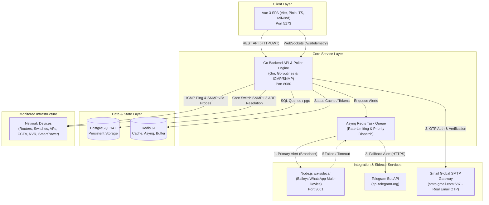

# 01 — System Architecture / Arsitektur Sistem

This document describes the concrete system architecture and core mechanics of **SANOC (Sanditel Network Operations Center)**.  
*Dokumen ini menjelaskan arsitektur sistem dan mekanika utama dari SANOC (Sanditel Network Operations Center).*

---

## 1. High-Level Architecture Overview / Gambaran Umum Arsitektur

SANOC is engineered as a modern, decoupled **three-service architecture** designed for high throughput network monitoring, fault-tolerant alerting, and real-time operator visibility.

*SANOC dirancang dengan arsitektur 3-layanan modern yang terpisah untuk pemantauan jaringan throughput tinggi, sistem peringatan andal, dan visibilitas operator real-time.*

---

## 2. Core Service Components / Komponen Utama Service

### 2.1 Go Backend (`/backend`)
- **API Engine**: Built in Go (Golang 1.22+) using standard Gin Web Framework. Serves REST endpoints for authentication, device management, incident tracking, reports, settings, and user administration.
- **Security & RBAC**: Protected routes use JWT middleware enforcing RBAC (`admin`, `pimpinan`, `anggota`), TOTP MFA (`pquerna/otp`), and 6-digit real email OTP verification.
- **SMTP Mailer Service (`/internal/mailer`)**: Connects to Gmail Global SMTP (`smtp.gmail.com:587` with STARTTLS) or local Mailpit for instant delivery of account verification and password reset OTP codes.
- **WebSocket Gateway (`/ws`)**: Pushes real-time polling logs (Live Feed) and state transition events (Notification Bell alerts) directly to connected browser clients.
- **Poller Engine (`/internal/poller`)**: Background daemon running inside the Go binary executing periodic health probes with debounce and flapping prevention.

### 2.2 Vue 3 Frontend (`/frontend`)
- **Single Page Application (SPA)**: Built with Vue 3 (Composition API), Vite, TypeScript, and Pinia state management.
- **Standardized English Interface**: All operational views (Dashboard, Devices, Incidents, Reports, Settings, Profile) use English by default.
- **Bilingual Help Center**: Dedicated Help Center documentation module with interactive Indonesian/English switcher (`ID / EN`).
- **Realtime Integration**: Subscribes to backend WebSockets (`/ws`) to dynamically update status badges, charts, and notification feeds without manual page reloads.

### 2.3 Node.js WhatsApp Sidecar (`/backend/wa-sidecar`)
- **Baileys Web API**: Independent Node.js service wrapping `@whiskeysockets/baileys` to connect to WhatsApp Web via QR Code pairing.
- **Multi-Target Broadcast**: Supports simultaneous alert broadcasting to all registered individual operator numbers and coordination groups (`@g.us`).
- **Token Security**: Communicates with the Go backend over internal HTTP authenticated via a shared Bearer token.
- **Session Persistence**: Stores session credentials on disk so WhatsApp connection survives service restarts without requiring re-pairing.

### 2.4 Data & State Infrastructure
- **PostgreSQL**: Stores relational domain entities (Users, User Logs, Devices, Device Status Logs, Metrics, Incidents, Notification Logs, WhatsApp Targets, Integration Settings).
- **Redis**: Acts as an in-memory cache for live device status (`device:status:<id>`), rate-limiting token bucket (`ratelimit:wa`), and Asynq background task queues.
