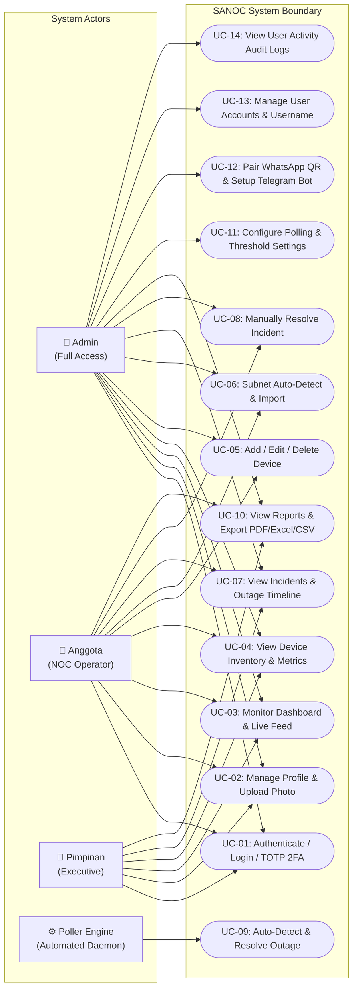

# 04 — Use Case Diagram / Diagram Use Case

This document presents the Use Case Diagram for **SANOC v2.6.0**, illustrating system interaction boundaries and RBAC permissions across all user roles and internal daemons.  
*Dokumen ini menyajikan Diagram Use Case untuk SANOC.*

---

## 1. Mermaid Use Case Diagram

