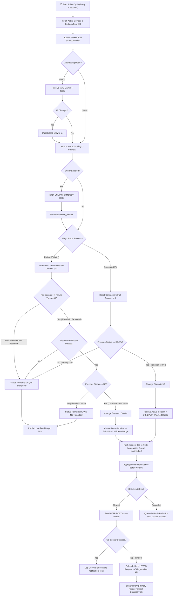

# 05 — Polling & Alerting Flowchart / Flowchart Polling & Notifikasi

This document details the complete technical decision logic from initial device probing through threshold counter evaluation, status transition detection, notification aggregation, rate limiting, and alert delivery fallback in **SANOC v2.6.0**.  
*Dokumen ini menjelaskan alur keputusan teknis dari eksekusi probe ICMP/SNMP hingga pengiriman notifikasi.*

---

## 1. Mermaid Polling-to-Notification Flowchart

