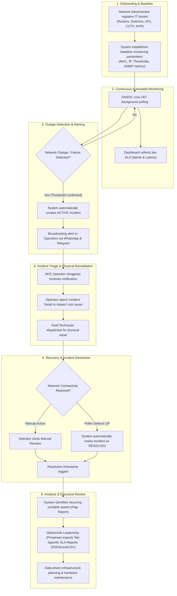

# 06 — Business Process Flow / Alur Proses Bisnis

This document describes the end-to-end business workflow of **SANOC v2.6.0** from an operational NOC perspective.  
*Dokumen ini menjelaskan alur proses bisnis operasional SANOC.*

---

## 1. Non-Technical Business Process Diagram

