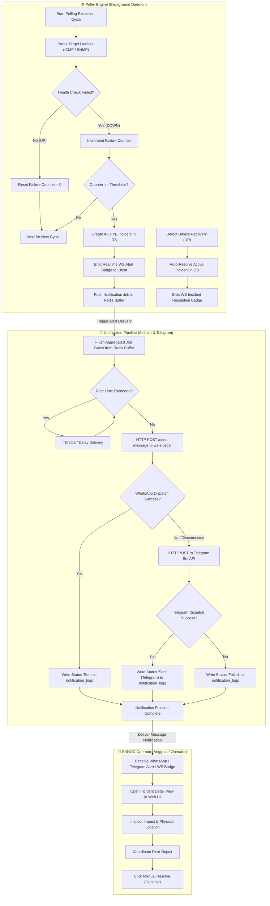

# 07 — Activity Diagram (Swimlane) / Diagram Aktivitas Swimlane

This document presents a Swimlane Activity Diagram illustrating the distributed actions and interactions between the **Poller Engine**, the **Notification Pipeline**, and **SANOC Operators (`anggota`)**.  
*Dokumen ini menyajikan Diagram Aktivitas Swimlane untuk SANOC.*

---

## 1. Mermaid Swimlane Activity Diagram

