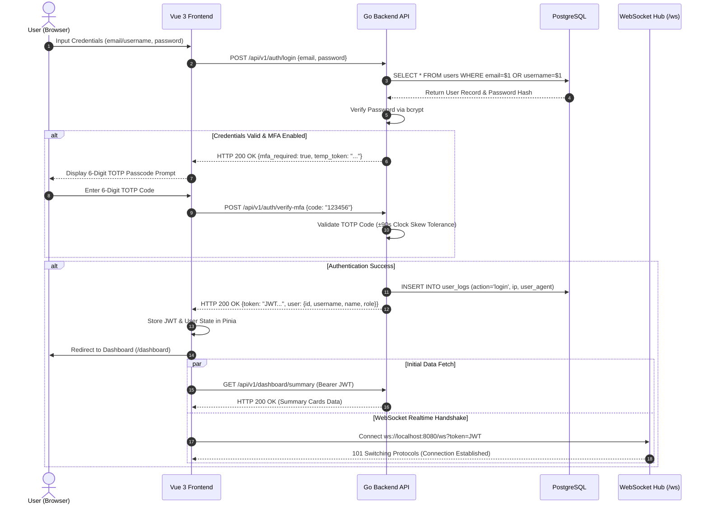
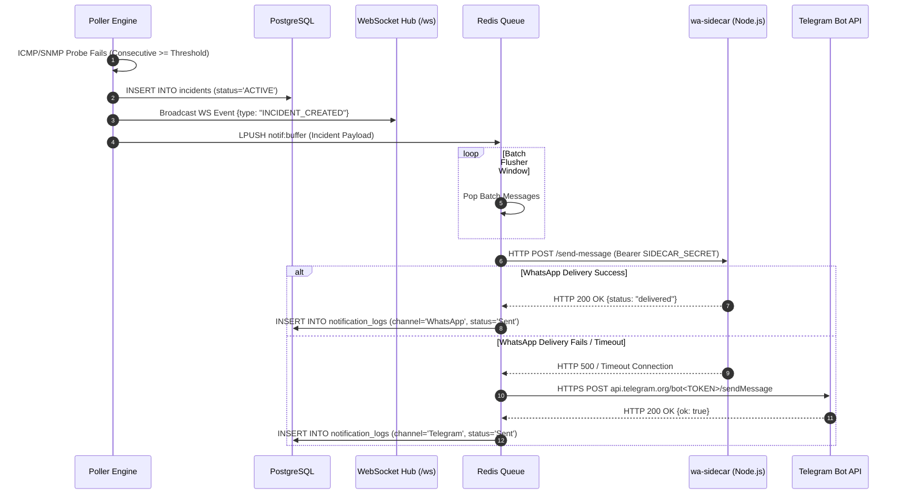

# 08 — Sequence Diagrams / Diagram Sekuensial

This document contains Mermaid Sequence Diagrams covering two core system workflows in **SANOC v2.6.0**: **User Authentication, TOTP MFA & WebSocket Subscription**, and **Incident Detection & Notification Dispatch**.  
*Dokumen ini menyajikan Diagram Sekuensial untuk SANOC.*

---

## 1. Sequence 1: User Login, TOTP MFA & Realtime WebSocket Subscription

---

## 2. Sequence 2: Incident Detection, Aggregation & Notification Dispatch

