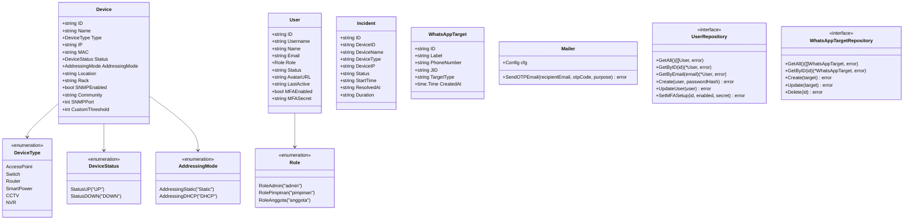

# 09 — Class Diagram / Diagram Kelas

This document presents the Mermaid Class Diagram for **SANOC v2.6.0**, detailing Go domain structs, core enums, setting structures, and repository interfaces.  
*Dokumen ini menyajikan Diagram Kelas untuk SANOC.*

---

## 1. Mermaid Class Diagram

