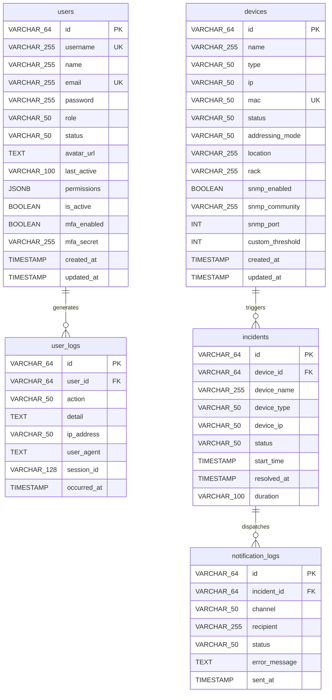

# 10 — Entity Relationship Diagram (ERD) / Diagram Relasi Entitas

This document presents the exact PostgreSQL database schema for **SANOC v2.6.0** (including Migration `016_security_mfa_schema.up.sql`).  
*Dokumen ini menyajikan Diagram Relasi Entitas (ERD) PostgreSQL untuk SANOC.*

---

## 1. Mermaid Entity Relationship Diagram

