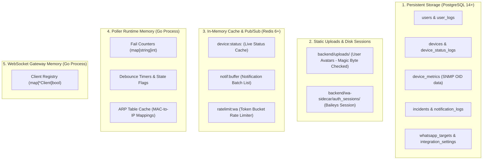

# 11 — Data & Memory Management / Manajemen Data & Memori

This document explains how state, persistent data, and in-memory caches are managed across the services of **SANOC v2.6.0**, detailing service restart recovery behaviors.  
*Dokumen ini menjelaskan manajemen data, memori, dan retensi pada SANOC.*

---

## 1. Data Tier & Persistence Storage Breakdown

---

## 2. Storage Layer Responsibilities

### 2.1 PostgreSQL (Relational Persistence)
- **Primary Source of Truth**: Stores immutable domain data including user accounts, usernames, TOTP MFA secrets, role permissions, device inventory, incident timelines, and audit logs.
- **Durability**: Survives system reboots, hardware crashes, and container redeployments.

### 2.2 Redis (Ephemeral Cache & Queue Buffer)
- **Live Device Status Cache** (`device:status:<id>`): High-speed cache hit by API handlers to render dashboard grids.
- **Notification Aggregation Buffer** (`notif:buffer`): List storing queued alert jobs during multi-device outages.

### 2.3 Local Disk Storage (`backend/uploads/` & `auth_sessions/`)
- **User Avatar Storage**: Images uploaded via `/profile` stored under `backend/uploads/` with sanitized names (`filepath.Base`) and magic-byte security checks.
- **WhatsApp Web Session**: Session keys stored on disk to preserve QR Code pairing across container restarts.
