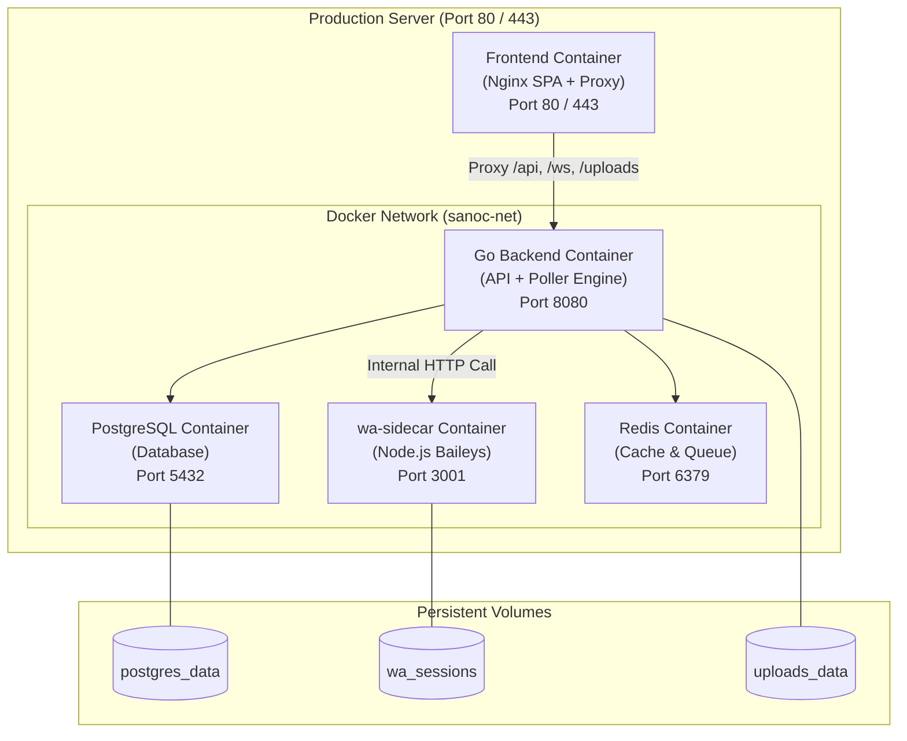

# 13 — Docker Deployment Guide / Panduan Deployment Docker

This guide provides instructions for containerizing and deploying **SANOC v2.6.0** using **Docker** and **Docker Compose**.  
*Panduan pengerahan SANOC menggunakan Docker.*

---

## 1. Containerization Architecture



---

## 2. Docker Compose Configuration (`docker-compose.yml`)

```yaml
version: '3.8'

services:
  postgres:
    image: postgres:14-alpine
    container_name: sanoc-postgres
    restart: always
    environment:
      POSTGRES_USER: ${SANOC_DB_USER:-sanoc_admin}
      POSTGRES_PASSWORD: ${SANOC_DB_PASSWORD:-secure_db_password}
      POSTGRES_DB: ${SANOC_DB_NAME:-sanoc}
    volumes:
      - postgres_data:/var/lib/postgresql/data

  redis:
    image: redis:7-alpine
    container_name: sanoc-redis
    restart: always

  backend:
    build:
      context: ./backend
      dockerfile: Dockerfile
    container_name: sanoc-backend
    restart: always
    environment:
      SANOC_PORT: 8080
      SANOC_DB_HOST: postgres
      SANOC_DB_PORT: 5432
      SANOC_DB_USER: ${SANOC_DB_USER:-sanoc_admin}
      SANOC_DB_PASSWORD: ${SANOC_DB_PASSWORD:-secure_db_password}
      SANOC_DB_NAME: ${SANOC_DB_NAME:-sanoc}
      SANOC_JWT_SECRET: ${SANOC_JWT_SECRET:-secure_jwt_secret}
    volumes:
      - uploads_data:/app/uploads
    depends_on:
      - postgres
      - redis

volumes:
  postgres_data:
  wa_sessions:
  uploads_data:
```
