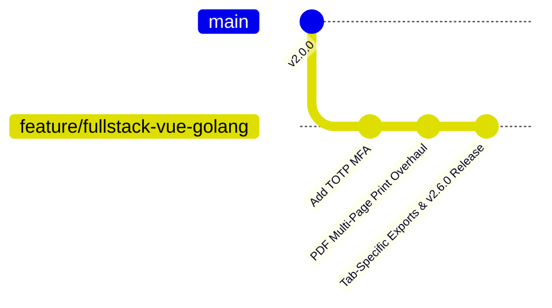

# 14 — Git Branching Workflow / Alur Kerja Git

This document outlines the Git branching strategy and practical command workflows for **SANOC v2.6.0**.  
*Panduan alur kerja Git untuk pengembanan dan pengerahan SANOC.*

---

## 1. Standard Branching Strategy



### Branch Naming Conventions
- `main`: Stable production release branch.
- `feature/fullstack-vue-golang`: Active development branch for SANOC features.
- `feature/<short-description>`: Specific feature branches.
- `fix/<issue-description>`: Bug fixes and security patches.

---

## 2. Remote Pushing Workflows / Perintah Push ke Remote

### Pushing Local Branch to Remote Feature Branch
```bash
git add .
git commit -m "feat: SANOC v2.6.0 - TOTP MFA, Profile Photo Upload, Tab-Specific Exports & PDF Print Overhaul"
git push origin feature/fullstack-vue-golang
```
