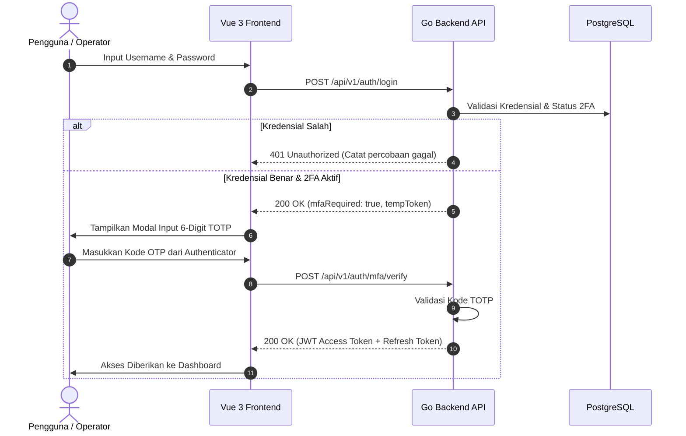

# 15 — Security, MFA & Bot Protection Guide
*Panduan Keamanan Sistem, TOTP 2FA, dan Proteksi Bot SANOC*

---

## 📌 Ringkasan Keamanan / Security Overview
Sistem **SANOC (Sanditel Network Operations Center)** menerapkan arsitektur keamanan bertingkat (*defense-in-depth*) untuk melindungi infrastruktur monitoring pemerintah dari ancaman siber, serangan *brute-force*, dan akses tanpa hak (*unauthorized access*).

---

## 🔐 1. Autentikasi Dua Faktor (TOTP 2FA / MFA)

SANOC mendukung **Two-Factor Authentication (2FA)** berbasis standar industri **RFC 6238 TOTP (Time-based One-Time Password)** yang kompatibel dengan aplikasi authenticator populer:
- **Google Authenticator**
- **Authy**
- **Microsoft Authenticator**

### 📱 Alur Aktivasi 2FA oleh Pengguna:
1. Masuk ke menu **User Profile** (`/profile`).
2. Pada bagian **Two-Factor Authentication (2FA)**, klik tombol **"Enable 2FA"**.
3. Sistem akan menghasilkan **QR Code** dan **Secret Key** unik secara aman.
4. Buka aplikasi Google Authenticator / Authy pada smartphone, lalu pindai QR Code tersebut.
5. Masukkan **6-digit kode verifikasi** dari aplikasi authenticator untuk mengonfirmasi aktivasi.
6. **Simpan Backup Codes**: Simpan kode cadangan darurat di tempat yang aman. Kode ini dapat digunakan jika perangkat ponsel hilang.

### 🛡️ Alur Login dengan 2FA:


---

## 🤖 2. Google reCAPTCHA & Perlindungan Brute-Force

Untuk mencegah serangan otomatis (*credential stuffing* dan *bot automated login*), SANOC dilengkapi proteksi Google reCAPTCHA v2 / v3 dan *Rate Limiter* berbasis IP & Username.

### Konfigurasi `.env`:
```env
# Aktifkan proteksi bot pada halaman login
RECAPTCHA_ENABLED=true
RECAPTCHA_SECRET_KEY=6LfPEYUtAAAAAFnaHB7J7dxz3eyvsZNG0OeiJEH8

# Batas maksimal percobaan login gagal per IP/Akun (Default: 5 kali per menit)
RATE_LIMIT_LOGIN_MAX=5
```

### Mekanisme Rate Limiting:
- Jika percobaan login gagal melebihi batas `RATE_LIMIT_LOGIN_MAX` dalam rentang waktu 15 menit, IP dan Username akan dikunci sementara (*temporary lock*).
- Setiap kegagalan dicatat pada audit log untuk deteksi dini serangan.

---

## 🔑 3. Pengelolaan JWT Token & Sesi Cookie Aman

1. **JWT Signature Key**:
   - Ditandatangani menggunakan algoritma HMAC-SHA256 (`JWT_SECRET`).
   - Wajib menggunakan string acak minimal 32 karakter pada lingkungan produksi.
2. **Atribut Keamanan Cookie (`Set-Cookie`)**:
   - `HttpOnly`: Mencegah token diakses melalui script berbahaya (XSS).
   - `Secure`: Cookie hanya dikirimkan melalui protokol terenkripsi HTTPS (`COOKIE_SECURE=true`).
   - `SameSite=Strict`: Mencegah serangan *Cross-Site Request Forgery* (CSRF).
   ```env
   COOKIE_SECURE=true
   COOKIE_SAMESITE=Strict
   JWT_EXPIRY=24h
   ```

---

## 👥 4. Role-Based Access Control (RBAC)

SANOC menerapkan pembagian hak akses matriks (*Granular Permission Matrix*) untuk 3 tingkatan peran:

| Fitur / Modul | Admin (Full Access) | Pimpinan (Executive) | Anggota SANOC (Operator) |
|---|:---:|:---:|:---:|
| **Dashboard & Monitoring Live** | ✅ Read / Write | ✅ Read Only | ✅ Read Only |
| **Device Inventory Management** | ✅ Create / Edit / Delete | ❌ No Access | ✅ View / Ping Test |
| **Incident Management** | ✅ Acknowledge & Resolve | ✅ View Reports | ✅ Acknowledge & Update |
| **SLA & Compliance Reports** | ✅ View & Export | ✅ View & Export | ✅ View & Export |
| **WhatsApp Target Management** | ✅ Full Control | ❌ No Access | ❌ No Access |
| **User & Role Management** | ✅ Create / Edit / OTP | ❌ No Access | ❌ No Access |
| **System Settings & Poller Engine** | ✅ Full Config | ❌ No Access | ❌ No Access |

---

## 📋 Checklist Keamanan Sebelum *Go-Live* Produksi:
- [ ] Ubah default `JWT_SECRET` menjadi nilai acak yang kuat di server produksi.
- [ ] Pastikan `COOKIE_SECURE=true` dan domain menggunakan sertifikat SSL/TLS valid (HTTPS).
- [ ] Aktifkan `RECAPTCHA_ENABLED=true` pada `.env`.
- [ ] Pastikan file `.env` memiliki permission `chmod 600` (hanya dapat dibaca oleh service user).
- [ ] Daftarkan akun Admin utama dan segera aktifkan TOTP 2FA.
