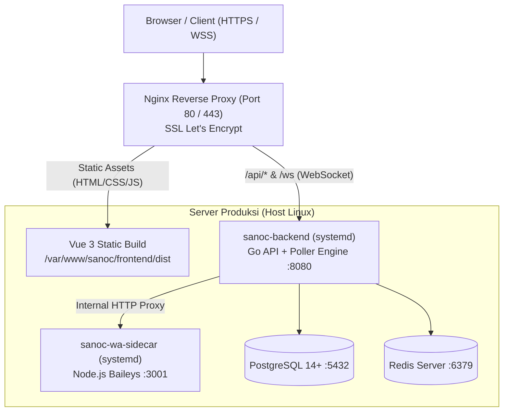

# 16 — Production Server Deployment Guide (VPS / Bare-Metal)
*Panduan Pengerahan SANOC pada Server Produksi (Linux VPS / Dedicated Server)*

---

## 📌 Ringkasan Pengerahan / Deployment Overview
Dokumen ini menjelaskan langkah-langkah instalasi, konfigurasi layanan latar belakang (*systemd*), *reverse proxy* Nginx dengan SSL, dan pemeliharaan server produksi untuk sistem **SANOC (Sanditel Network Operations Center)** pada OS Linux (Ubuntu 22.04 / 24.04 LTS atau Debian 12).

---

## 🧱 1. Arsitektur Layanan Produksi



---

## 🛠️ 2. Prasyarat Server & Dependensi

Jalankan perintah pembaruan paket dan instalasi dependensi:
```bash
sudo apt update && sudo apt upgrade -y
sudo apt install -y curl wget git build-essential nginx postgresql postgresql-contrib redis-server certbot python3-certbot-nginx
```

### Instalasi Go 1.22+:
```bash
wget https://go.dev/dl/go1.22.6.linux-amd64.tar.gz
sudo rm -rf /usr/local/go && sudo tar -C /usr/local -xzf go1.22.6.linux-amd64.tar.gz
echo 'export PATH=$PATH:/usr/local/go/bin' >> ~/.bashrc
source ~/.bashrc
go version
```

### Instalasi Node.js 20 LTS:
```bash
curl -fsSL https://deb.nodesource.com/setup_20.x | sudo -E bash -
sudo apt install -y nodejs
node -v && npm -v
```

---

## 🗄️ 3. Konfigurasi Database PostgreSQL & Redis

### Konfigurasi PostgreSQL:
```bash
sudo -u postgres psql
```
Jalankan query SQL:
```sql
CREATE DATABASE sanoc;
CREATE USER sanoc_admin WITH ENCRYPTED PASSWORD 'KataSandiDatabaseKuat2026!';
GRANT ALL PRIVILEGES ON DATABASE sanoc TO sanoc_admin;
\c sanoc
GRANT ALL ON SCHEMA public TO sanoc_admin;
\q
```

---

## 🚀 4. Build Aplikasi (Frontend & Backend)

### Siapkan Direktori Aplikasi:
```bash
sudo mkdir -p /var/www/sanoc
sudo chown -R $USER:$USER /var/www/sanoc
cd /var/www/sanoc

# Clone repositori Anda
git clone <URL_REPOSITORY_GIT> .
```

### A. Build Frontend (Vue 3 + Vite):
```bash
cd /var/www/sanoc/frontend
npm install
npm run build
# Hasil build produksi berada di /var/www/sanoc/frontend/dist
```

### B. Build Backend (Go):
```bash
cd /var/www/sanoc/backend
go build -ldflags="-s -w" -o sanoc-api ./cmd/api
chmod +x sanoc-api

# Jalankan migrasi database
./sanoc-api --migrate
```

### C. Build WhatsApp Sidecar (Node.js):
```bash
cd /var/www/sanoc/backend/wa-sidecar
npm install --production
```

---

## ⚙️ 5. Konfigurasi Service Systemd

### A. Service Backend (`/etc/systemd/system/sanoc-backend.service`):
```ini
[Unit]
Description=SANOC Go Backend API & Poller Engine
After=network.target postgresql.service redis.service

[Service]
Type=simple
User=root
WorkingDirectory=/var/www/sanoc/backend
ExecStart=/var/www/sanoc/backend/sanoc-api
Restart=always
RestartSec=5s
EnvironmentFile=/var/www/sanoc/backend/.env
LimitNOFILE=65535

[Install]
WantedBy=multi-user.target
```

### B. Service WhatsApp Sidecar (`/etc/systemd/system/sanoc-wa-sidecar.service`):
```ini
[Unit]
Description=SANOC WhatsApp Baileys Gateway Sidecar
After=network.target

[Service]
Type=simple
User=root
WorkingDirectory=/var/www/sanoc/backend/wa-sidecar
ExecStart=/usr/bin/node index.js
Restart=always
RestartSec=5s
Environment=NODE_ENV=production
Environment=PORT=3001
EnvironmentFile=/var/www/sanoc/backend/.env

[Install]
WantedBy=multi-user.target
```

### Aktifkan dan Jalankan Services:
```bash
sudo systemctl daemon-reload
sudo systemctl enable --now sanoc-backend
sudo systemctl enable --now sanoc-wa-sidecar

# Cek status layanan
sudo systemctl status sanoc-backend
sudo systemctl status sanoc-wa-sidecar
```

---

## 🌐 6. Konfigurasi Nginx & SSL Let's Encrypt

Buat file konfigurasi Nginx: `/etc/nginx/sites-available/sanoc.conf`:
```nginx
server {
    listen 80;
    server_name monitoring.jabarprov.go.id; # Sesuaikan domain Anda

    root /var/www/sanoc/frontend/dist;
    index index.html;

    # Gzip Compression
    gzip on;
    gzip_types text/plain text/css application/json application/javascript text/xml application/xml application/xml+rss text/javascript image/svg+xml;

    # SPA Frontend Routing
    location / {
        try_files $uri $uri/ /index.html;
    }

    # Proxy API Endpoints
    location /api/ {
        proxy_pass http://127.0.0.1:8080;
        proxy_http_version 1.1;
        proxy_set_header Host $host;
        proxy_set_header X-Real-IP $remote_addr;
        proxy_set_header X-Forwarded-For $proxy_add_x_forwarded_for;
        proxy_set_header X-Forwarded-Proto $scheme;
        proxy_read_timeout 90s;
    }

    # Proxy Real-time WebSockets
    location /ws {
        proxy_pass http://127.0.0.1:8080/ws;
        proxy_http_version 1.1;
        proxy_set_header Upgrade $http_upgrade;
        proxy_set_header Connection "Upgrade";
        proxy_set_header Host $host;
        proxy_set_header X-Real-IP $remote_addr;
        proxy_set_header X-Forwarded-For $proxy_add_x_forwarded_for;
        proxy_read_timeout 86400s;
        proxy_send_timeout 86400s;
    }

    # Static Uploads (Avatars, Evidence)
    location /uploads/ {
        alias /var/www/sanoc/backend/uploads/;
        expires 30d;
        add_header Cache-Control "public, no-transform";
    }
}
```

### Aktifkan Konfigurasi & Pasang SSL:
```bash
sudo ln -s /etc/nginx/sites-available/sanoc.conf /etc/nginx/sites-enabled/
sudo nginx -t
sudo systemctl reload nginx

# Dapatkan sertifikat SSL otomatis dari Let's Encrypt
sudo certbot --nginx -d monitoring.jabarprov.go.id
```

---

## 🔄 7. Prosedur Update Versi Baru (*Deployment Update*)

Jika ada pembaruan kode di git:
```bash
cd /var/www/sanoc
git pull origin feature/fullstack-vue-golang

# Update Frontend
cd frontend && npm install && npm run build

# Update Backend
cd ../backend && go build -ldflags="-s -w" -o sanoc-api ./cmd/api
sudo systemctl restart sanoc-backend

# Update WhatsApp Sidecar (jika ada update)
cd wa-sidecar && npm install --production
sudo systemctl restart sanoc-wa-sidecar

echo "SANOC successfully updated!"
```
